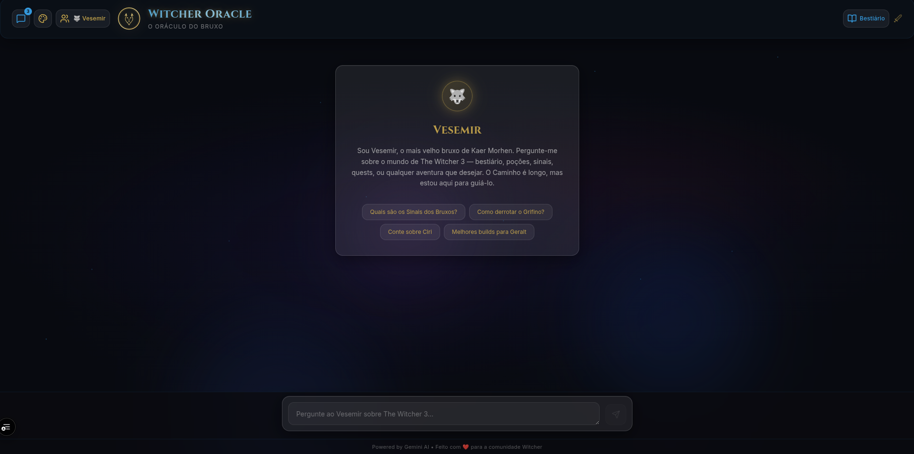

# 🐺 Witcher Oracle - O Oráculo do Bruxo

<div align="center">


**Um chat de IA temático de The Witcher 3 com interface glassmorphism, onde o mestre bruxo Vesemir responde suas perguntas sobre o mundo de Witcher.**

[Funcionalidades](#-funcionalidades) •
[Instalação](#-instalação) •
[Configuração](#-configuração) •
[Arquitetura](#-arquitetura) •
[Contribuição](#-contribuição)

---

<!-- Screenshot placeholder -->


</div>

---

## 📖 Sobre o Projeto

**Witcher Oracle** é um chat interativo alimentado por IA, ambientado no universo de The Witcher 3: Wild Hunt. A aplicação utiliza a API do Google Gemini (tier gratuito) para dar vida ao personagem **Vesemir** — o bruxo mais velho e experiente de Kaer Morhen — que guia os usuários com sabedoria sobre lore, quests, builds, dicas de combate, alquimia, personagens e tudo mais sobre o mundo de Witcher.

A interface é construída com um tema **glassmorphism** imersivo, utilizando uma paleta dark com tons de azul escuro, roxo e dourado/âmbar — refletindo a atmosfera sombria e fantástica do universo Witcher.

### ✨ Destaques

- 🆓 **100% Gratuito** — Sem custos, sem login, sem cadastro
- 🐺 **Persona Imersiva** — Vesemir responde como se estivesse em Kaer Morhen
- 🎨 **Glassmorphism UI** — Interface moderna com glass cards, blur effects e neon glow
- 📱 **Responsivo** — Funciona perfeitamente em desktop e mobile
- ⚡ **Streaming** — Respostas em tempo real com streaming da API

---

## 🎯 Funcionalidades

### Core

- 💬 Chat conversacional sobre o universo de The Witcher 3
- 🧙 Respostas contextualizadas na persona do Vesemir
- 📚 Conhecimento sobre lore, quests, personagens, builds, alquimia e dicas
- ⚡ Streaming de respostas em tempo real
- 🎭 Mensagem de boas-vindas temática do Vesemir

### Interface

- 🪟 Componentes com glassmorphism (glass cards, blur, transparência)
- 🌌 Background temático com atmosfera dark fantasy
- ✨ Animações suaves com Framer Motion
- 💬 Bolhas de chat estilizadas (usuário + IA)
- ⌨️ Indicador de digitação animado
- 📜 Auto-scroll nas mensagens
- 📱 Layout totalmente responsivo

---

## 🛠️ Stack Tecnológica

| Tecnologia            | Versão    | Uso                                         |
| --------------------- | --------- | ------------------------------------------- |
| **Next.js**           | 16        | Framework React com App Router e API Routes |
| **TypeScript**        | 5         | Tipagem estática                            |
| **Tailwind CSS**      | 4         | Estilização utility-first e glassmorphism   |
| **Google Gemini API** | Free Tier | Motor de IA para respostas contextualizadas |
| **Framer Motion**     | 12        | Animações e transições                      |
| **Lucide React**      | 1.7       | Ícones                                      |
| **Jest**              | 30        | Testes unitários                            |
| **Testing Library**   | 16        | Testes de componentes React                 |

---

## 📋 Pré-requisitos

Antes de começar, certifique-se de ter instalado:

- **Node.js** 18.0 ou superior — [Download](https://nodejs.org/)
- **npm** 9.0 ou superior (vem junto com o Node.js)
- **Google Gemini API Key** (gratuita) — veja [como obter](#-como-obter-a-api-key-gratuita-do-google-gemini)

Verifique suas versões:

```bash
node --version   # v18.0.0+
npm --version    # 9.0.0+
```

---

## 🚀 Instalação

### Passo 1: Clonar o repositório

```bash
git clone https://github.com/seu-usuario/witcher-oracle.git
cd witcher-oracle
```

### Passo 2: Instalar dependências

```bash
npm install
```

### Passo 3: Configurar variáveis de ambiente

Crie o arquivo `.env.local` na raiz do projeto:

```bash
cp .env.example .env.local
```

Edite o arquivo `.env.local` e adicione sua API key:

```env
GEMINI_API_KEY=sua_api_key_aqui
```

### Passo 4: Rodar o projeto

```bash
npm run dev
```

Abra [http://localhost:3000](http://localhost:3000) no seu navegador e comece a conversar com Vesemir! 🐺

---

## 🔑 Como Obter a API Key Gratuita do Google Gemini

1. Acesse o **Google AI Studio**: [https://aistudio.google.com/](https://aistudio.google.com/)
2. Faça login com sua conta Google
3. Clique em **"Get API Key"** no menu lateral
4. Clique em **"Create API Key"**
5. Selecione um projeto do Google Cloud (ou crie um novo)
6. Copie a API key gerada
7. Cole no seu arquivo `.env.local`

> ⚠️ **Importante:** O tier gratuito do Gemini API possui limites de requisições (15 RPM / 1.500 RPD / 1M TPM para o modelo Gemini Flash). Para uso pessoal e desenvolvimento, esses limites são mais que suficientes.

> 🔒 **Segurança:** Nunca compartilhe sua API key publicamente ou faça commit dela no repositório. O arquivo `.env.local` já está incluído no `.gitignore`.

---

## ⚙️ Configuração

### Variáveis de Ambiente

| Variável         | Obrigatória | Descrição                     |
| ---------------- | ----------- | ----------------------------- |
| `GEMINI_API_KEY` | ✅ Sim      | Chave da API do Google Gemini |

### Arquivo `.env.local`

```env
# Google Gemini API
GEMINI_API_KEY=sua_api_key_aqui
```

---

## 📜 Scripts Disponíveis

| Script    | Comando         | Descrição                                           |
| --------- | --------------- | --------------------------------------------------- |
| **dev**   | `npm run dev`   | Inicia o servidor de desenvolvimento com hot-reload |
| **build** | `npm run build` | Gera o build otimizado de produção                  |
| **start** | `npm run start` | Inicia o servidor de produção (requer build)        |
| **lint**  | `npm run lint`  | Executa o ESLint para verificação de código         |
| **test**  | `npm run test`  | Executa os testes unitários com Jest                |

---

## 📂 Estrutura do Projeto

```
witcher-chat/
├── public/                          # Arquivos estáticos
│   └── screenshot-placeholder.png   # Placeholder do screenshot
├── src/
│   ├── app/                         # App Router (Next.js)
│   │   ├── api/
│   │   │   └── chat/
│   │   │       └── route.ts         # API Route - integração com Gemini
│   │   ├── globals.css              # Estilos globais + glassmorphism theme
│   │   ├── layout.tsx               # Layout raiz da aplicação
│   │   ├── page.tsx                 # Página principal do chat
│   │   └── favicon.ico              # Ícone da aplicação
│   ├── components/                  # Componentes React
│   │   ├── ui/
│   │   │   └── GlassCard.tsx        # Card com efeito glassmorphism
│   │   ├── ChatContainer.tsx        # Container principal do chat
│   │   ├── ChatInput.tsx            # Input de mensagens
│   │   ├── ChatMessage.tsx          # Bolha de mensagem (user/AI)
│   │   ├── Header.tsx               # Cabeçalho com logo/título
│   │   └── TypingIndicator.tsx      # Indicador de digitação
│   ├── lib/                         # Utilitários e configurações
│   │   └── gemini.ts                # Configuração do Google Gemini
│   ├── types/                       # Tipagens TypeScript
│   │   └── chat.ts                  # Tipos do chat
│   └── __tests__/                   # Testes unitários
│       ├── components/              # Testes de componentes
│       └── api/                     # Testes de API routes
├── .env.local                       # Variáveis de ambiente (não commitado)
├── .env.example                     # Exemplo de variáveis de ambiente
├── .gitignore                       # Arquivos ignorados pelo Git
├── BRAINSTORM.md                    # Documento de brainstorm do projeto
├── SPRINTS.md                       # Plano de sprints e tarefas
├── README.md                        # Este arquivo
├── jest.config.ts                   # Configuração do Jest
├── next.config.ts                   # Configuração do Next.js
├── package.json                     # Dependências e scripts
├── postcss.config.mjs               # Configuração do PostCSS
├── tailwind.config.ts               # Configuração do Tailwind CSS
└── tsconfig.json                    # Configuração do TypeScript
```

---

## 🏗️ Arquitetura

```
┌─────────────────────────────────────────────────────────────┐
│                        CLIENTE                              │
│                                                             │
│  ┌──────────┐  ┌──────────────┐  ┌───────────────────────┐ │
│  │  Header   │  │  ChatInput   │  │    ChatContainer      │ │
│  │          │  │  (glassmorp.) │  │  ┌─────────────────┐  │ │
│  └──────────┘  └──────┬───────┘  │  │  ChatMessage[]   │  │ │
│                       │          │  │  TypingIndicator  │  │ │
│                       │          │  └─────────────────┘  │ │
│                       │          └───────────────────────┘ │
└───────────────────────┼─────────────────────────────────────┘
                        │ POST /api/chat
                        │ { message: string }
                        ▼
┌─────────────────────────────────────────────────────────────┐
│                   NEXT.JS API ROUTE                         │
│                                                             │
│  ┌─────────────────────────────────────────────────────┐   │
│  │  /api/chat/route.ts                                  │   │
│  │  - Recebe mensagem do usuário                        │   │
│  │  - Envia para Gemini com system prompt do Vesemir    │   │
│  │  - Retorna resposta via streaming                    │   │
│  │  - Error handling + rate limiting                    │   │
│  └──────────────────────┬──────────────────────────────┘   │
└─────────────────────────┼───────────────────────────────────┘
                          │ Google Generative AI SDK
                          ▼
┌─────────────────────────────────────────────────────────────┐
│                  GOOGLE GEMINI API                           │
│                                                             │
│  Modelo: Gemini Flash (free tier)                           │
│  System Prompt: Persona do Vesemir de Kaer Morhen           │
│  Contexto: Universo completo de The Witcher 3               │
└─────────────────────────────────────────────────────────────┘
```

### Fluxo de Dados

1. **Usuário** digita uma mensagem no `ChatInput`
2. A mensagem é enviada via `POST` para `/api/chat`
3. A **API Route** processa a mensagem e envia para o **Google Gemini** com o system prompt do Vesemir
4. A resposta é retornada via **streaming** para o cliente
5. O `ChatContainer` renderiza a resposta progressivamente no `ChatMessage`
6. O `TypingIndicator` é exibido enquanto a IA está gerando a resposta

---

## 🎨 Tema e Customização

### Paleta de Cores

O tema é inspirado no universo sombrio e fantástico de The Witcher 3:

| Cor                   | Hex                     | Uso                       |
| --------------------- | ----------------------- | ------------------------- |
| 🔵 Azul Escuro        | `#0a0e1a`               | Background principal      |
| 🟣 Roxo Profundo      | `#1a0a2e`               | Gradientes e acentos      |
| 🟡 Dourado/Âmbar      | `#d4a340`               | Destaques, bordas, ícones |
| ⚪ Branco Translúcido | `rgba(255,255,255,0.1)` | Glass cards               |
| 🔵 Azul Witcher       | `#1e3a5f`               | Elementos secundários     |

### Glassmorphism

Os componentes de vidro utilizam:

- `backdrop-filter: blur(16px)` — Efeito de desfoque
- `background: rgba(255, 255, 255, 0.05-0.1)` — Transparência
- `border: 1px solid rgba(255, 255, 255, 0.1)` — Bordas sutis
- `box-shadow` com glow sutil — Efeito de brilho

---

## 🧪 Testes

O projeto utiliza **Jest** + **Testing Library** para testes unitários e de componentes.

```bash
# Rodar todos os testes
npm run test

# Rodar testes em modo watch
npx jest --watch

# Rodar testes com cobertura
npx jest --coverage
```

---

## 🤝 Contribuição

Contribuições são muito bem-vindas! Siga os passos abaixo:

1. **Fork** o repositório
2. Crie uma **branch** para sua feature:
   ```bash
   git checkout -b feature/minha-feature
   ```
3. Faça **commit** das suas alterações:
   ```bash
   git commit -m "feat: adiciona minha feature"
   ```
4. Faça **push** para a branch:
   ```bash
   git push origin feature/minha-feature
   ```
5. Abra um **Pull Request**

### Padrão de Commits

Este projeto segue o padrão [Conventional Commits](https://www.conventionalcommits.org/):

- `feat:` — Nova funcionalidade
- `fix:` — Correção de bug
- `docs:` — Alterações na documentação
- `style:` — Formatação, ponto e vírgula, etc.
- `refactor:` — Refatoração de código
- `test:` — Adição ou correção de testes
- `chore:` — Tarefas de manutenção

---

## 📄 Licença

Este projeto está licenciado sob a **Licença MIT** — veja o arquivo [LICENSE](LICENSE) para detalhes.

```
MIT License

Copyright (c) 2025 Witcher Oracle

Permission is hereby granted, free of charge, to any person obtaining a copy
of this software and associated documentation files (the "Software"), to deal
in the Software without restriction, including without limitation the rights
to use, copy, modify, merge, publish, distribute, sublicense, and/or sell
copies of the Software, and to permit persons to whom the Software is
furnished to do so, subject to the following conditions:

The above copyright notice and this permission notice shall be included in all
copies or substantial portions of the Software.

THE SOFTWARE IS PROVIDED "AS IS", WITHOUT WARRANTY OF ANY KIND, EXPRESS OR
IMPLIED, INCLUDING BUT NOT LIMITED TO THE WARRANTIES OF MERCHANTABILITY,
FITNESS FOR A PARTICULAR PURPOSE AND NONINFRINGEMENT. IN NO EVENT SHALL THE
AUTHORS OR COPYRIGHT HOLDERS BE LIABLE FOR ANY CLAIM, DAMAGES OR OTHER
LIABILITY, WHETHER IN AN ACTION OF CONTRACT, TORT OR OTHERWISE, ARISING FROM,
OUT OF OR IN CONNECTION WITH THE SOFTWARE OR THE USE OR OTHER DEALINGS IN THE
SOFTWARE.
```

---

## 🙏 Créditos

- **The Witcher 3: Wild Hunt** — CD Projekt RED — pela criação do universo incrível que inspira este projeto
- **Andrzej Sapkowski** — autor da saga literária original de The Witcher
- **Google Gemini** — pela API de IA generativa com tier gratuito
- **Next.js** — Vercel — pelo framework React de excelência
- **Tailwind CSS** — pela estilização utility-first
- **Framer Motion** — pelas animações suaves e declarativas

> ⚠️ **Disclaimer:** Este é um projeto de fã, não oficial, criado apenas para fins educacionais e de entretenimento. The Witcher® é marca registrada da CD Projekt RED. Este projeto não possui afiliação com a CD Projekt RED ou Andrzej Sapkowski.

---

<div align="center">

**Feito com 🐺 e ☕ por fãs de Witcher**

_"O mal é o mal. Menor, maior, médio — faz diferença? O grau é arbitrário. A definição é borrada."_
— **Geralt de Rívia**

</div>
